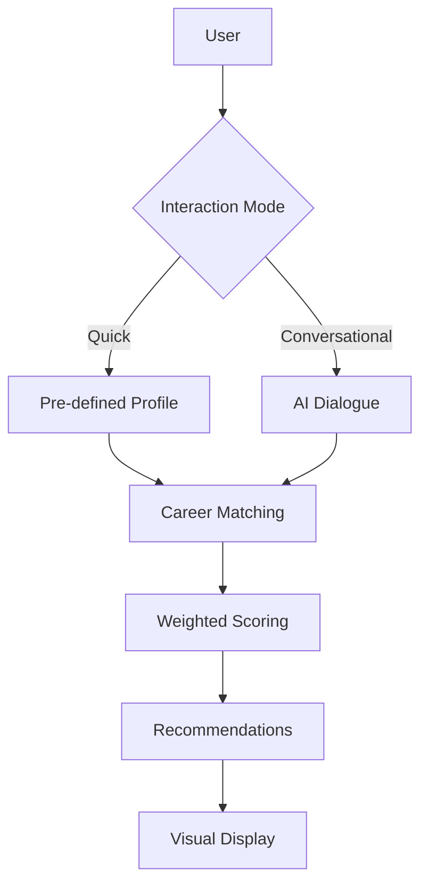

# 🚀 PathFinder - AI Career Counselor  
**Discover your ideal career path through AI-powered recommendations**  
*Ultra-fast responses powered by Groq's cutting-edge LLMs*

---

## 🌟 Features & Capabilities

### 🎯 Dual Interaction Modes
| **Quick Mode** | **Conversational Mode** |
|----------------|-------------------------|
| ⚡ Instant recommendations | 💬 Personalized AI dialogue |
| 📋 Pre-defined scenarios | 🧠 Adaptive questioning |
| 🚀 Rapid exploration | 📊 Comprehensive profile building |
| Perfect for time-constrained users | Ideal for deep career discovery |

### 🚀 Core Technologies
- **⚡ Groq Inference Engine**: 10x faster than traditional APIs
- **🧠 Hybrid Matching System**: Combines AI insights with rule-based logic
- **📊 Weighted Scoring**:
  ```python
  total_score = (interests * 0.3) + (academics * 0.25) + 
                (skills * 0.2) + (goals * 0.15) + (activities * 0.1)
  ```
- **📱 Responsive Design**: Works flawlessly on mobile, tablet, and desktop

---

## 🧩 Project Structure
```bash
.
├── app.py                # Main Streamlit application
├── config.toml           # UI configuration (themes, layout)
├── main_cli.py           # CLI entry point
├── requirements.txt      # Python dependencies
├── .env.example          # Environment template
├── LICENSE.md
├── PRIVACY.md
├── README.md             # This document
└── src/                  # Core application logic
    ├── career_database.py    # 25+ careers with detailed info
    ├── career_matcher.py     # Weighted scoring algorithm
    ├── cli_interface.py      # Command-line interface
    ├── conversation_manager.py # Dialogue handler
    ├── llm_client.py         # Groq API integration
    ├── models.py             # Pydantic data models
    └── prompt_templates.py   # AI conversation templates
```

---

## 🚀 Getting Started

### Prerequisites
- Python 3.8+
- [Groq API key](https://console.groq.com) (free account)

### Installation
```bash
git clone https://github.com/AryaInGit/pathfinder-career-counselor.git
cd pathfinder-career-counselor

# Create virtual environment (recommended)
python -m venv venv
source venv/bin/activate  # Linux/MacOS
venv\Scripts\activate     # Windows

pip install -r requirements.txt
```

### Configuration
1. Get your Groq API key from [console.groq.com](https://console.groq.com)
2. Create `.env` file:
   ```bash
   cp .env.example .env
   ```
3. Add your API key to `.env`:
   ```env
   GROQ_API_KEY="your_api_key_here"
   # Optional customizations:
   MODEL_NAME="llama3-70b-8192"
   TEMPERATURE=0.7
   MAX_TOKENS=1024
   ```

### Launching the Application
**Web Interface:**
```bash
streamlit run app.py
```

**Command-Line Interface:**
```bash
python main_cli.py
```

---

## ⚙️ Customization Guide

### Career Database
Edit `src/career_database.py` to add/update careers:
```python
CAREERS = {
    "Data Scientist": {
        "description": "Extract insights from complex datasets...",
        "salary": "$100,000 - $150,000",
        "education": "Master's in Computer Science",
        "skills": ["Python", "Machine Learning", "Statistics"],
        "outlook": "Growing 22% faster than average",
        "category": "STEM & Technology"
    },
    # Add more careers here
}
```

### Matching Algorithm
Adjust weights in `src/career_matcher.py`:
```python
WEIGHTS = {
    'interests': 0.35,    # Increased importance
    'academics': 0.25,
    'skills': 0.15,       # Reduced importance
    'goals': 0.15,
    'extracurriculars': 0.1
}
```

### UI Customization
Modify `config.toml` for theme changes:
```toml
[theme]
primaryColor = "#4f8af4"
backgroundColor = "#f0f5f9"
secondaryBackgroundColor = "#e1e8f0"
textColor = "#1a1a1a"
font = "sans serif"
```

---

## 🌐 Deployment Options

### Streamlit Cloud (Recommended)
1. Fork this repository
2. Create account at [streamlit.io/cloud](https://streamlit.io/cloud)
3. New App → Connect GitHub repository
4. Set secrets:
   ```toml
   GROQ_API_KEY = "your_api_key"
   MODEL_NAME = "llama3-70b-8192"
   TEMPERATURE = "0.7"
   MAX_TOKENS = "1024"
   ```

### Docker Deployment
1. Build image:
   ```dockerfile
   FROM python:3.11-slim
   WORKDIR /app
   COPY . .
   RUN pip install -r requirements.txt
   EXPOSE 8501
   CMD ["streamlit", "run", "app.py", "--server.port=8501"]
   ```
2. Run container:
   ```bash
   docker build -t pathfinder .
   docker run -p 8501:8501 -e GROQ_API_KEY=your_key pathfinder
   ```

### Other Platforms
| Platform | Command |
|----------|---------|
| **Heroku** | `web: streamlit run app.py --server.port=$PORT` |
| **AWS EC2** | Use PM2: `pm2 start "streamlit run app.py"` |
| **Google Cloud Run** | Deploy as container with port 8501 |

---

## 🧠 Technical Architecture

### ⚡ Groq Model Comparison
| Model | Speed | Quality | Best For |
|-------|-------|---------|----------|
| `llama3-8b-8192` | ⚡⚡⚡⚡ | ⭐⭐ | Quick interactions |
| `llama3-70b-8192` | ⚡⚡ | ⭐⭐⭐⭐ | High-quality recommendations |
| `mixtral-8x7b-32768` | ⚡⚡⚡ | ⭐⭐⭐ | Balanced use |
| `gemma-7b-it` | ⚡⚡⚡ | ⭐⭐ | Alternative option |

### 🔄 System Workflow


---

## 🐛 Troubleshooting

### Common Issues & Solutions
| Issue | Solution |
|-------|----------|
| **API Key Errors** | Verify key at [console.groq.com](https://console.groq.com) |
| **Module Not Found** | Run `pip install -r requirements.txt` |
| **Streamlit Caching Issues** | Execute `streamlit cache clear` |
| **Slow Responses** | Switch to `llama3-8b-8192` model |
| **Incomplete Outputs** | Increase `MAX_TOKENS` in `.env` |

**Debug Mode:** Add `DEBUG=true` to `.env` for detailed logs

---

## 📄 License
Distributed under the MIT License. See `LICENSE.md` for more information.

## 🤝 Contributing
1. Fork the repository
2. Create your feature branch (`git checkout -b feature/amazing-feature`)
3. Commit your changes (`git commit -m 'Add some amazing feature'`)
4. Push to the branch (`git push origin feature/amazing-feature`)
5. Open a pull request

## 📞 Support
For assistance, please open an issue in the [GitHub repository](https://github.com/AryaInGit/pathfinder-career-counselor/issues).

---

> **"🎓 Empowering students to discover their ideal career paths  
> ⚡ Powered by Groq's lightning-fast AI inference  
> 💬 Featuring dual-mode guidance: Quick Exploration & Deep Conversation"**
